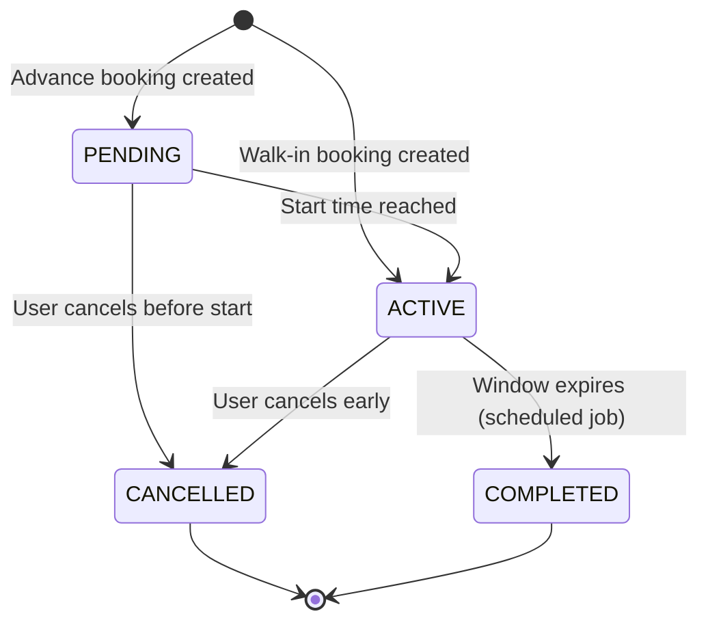

# ParkWise

**A real-time parking reservation and occupancy platform** — live per-floor parking
maps, OTP-verified advance bookings, mobile-only walk-in bookings, and instant
multi-user consistency via WebSocket + Redis Pub/Sub.


## Live Demo
- Frontend: `https://banrish777.github.io/parkwise`
- Backend API: Coming Soon

*(Note: free-tier backends may spin down after inactivity; first request can take
a few seconds.)*

## Overview
ParkWise models a multi-floor parking facility where customers reserve a specific
space in advance or claim one instantly as a walk-in, while every connected viewer of
a floor sees space-level occupancy update live — no polling, no refresh.

## Why This Project
This project was built to demonstrate real-time backend engineering under genuine
concurrency pressure — two users can target the same physical space at the same
instant, and the system must guarantee exactly one of them wins while every other
client is notified within the same second. It intentionally stays a well-tested,
containerized monolith rather than reaching for microservices or message queues,
reflecting how a focused real-time feature is actually built in production without
unnecessary infrastructure.

## Tech Stack

| Layer | Technology |
|---|---|
| Backend | Java 21, Spring Boot 3.x, Spring Security, Spring Data JPA |
| Real-Time | Spring WebSocket, Redis Pub/Sub |
| Auth | JWT, OTP (advance bookings), RBAC |
| Database | PostgreSQL |
| Frontend | Angular, TypeScript, Angular Signals, RxJS, Tailwind CSS |
| Infra | Docker, Docker Compose |
| Testing | JUnit 5, Mockito |
| CI | GitHub Actions |

## Core Features
- Live, per-floor parking map (BookMyShow/RedBus-style space selection)
- OTP-verified advance reservations (up to 5 hours)
- Mobile-only walk-in reservations from a capped sub-pool
- Real-time occupancy broadcast — every viewer of a floor sees changes instantly
- Reservation cancellation and automatic expiry
- Deferred password setup + standard login for returning users
- Admin facility management and occupancy dashboard

## Reservation Lifecycle



## Architecture
See [`docs/architecture.md`](docs/architecture.md) for the full backend and
frontend architectural blueprint, including package structure, layer
responsibilities, locking strategy, and design decisions.

## Getting Started

### Prerequisites
- Docker & Docker Compose, Java 21, Maven, Node.js 20+

### One-Command Local Stack
```bash
docker compose up -d
```
This starts PostgreSQL and Redis. Then:

### Database
```bash
psql -h localhost -U parkwise -d parkwise -f database/schema.sql
psql -h localhost -U parkwise -d parkwise -f database/init.sql
```

### Backend
```bash
cd backend
mvn clean install
mvn spring-boot:run
```

### Frontend
```bash
cd frontend
npm install
ng serve
```

Visit `http://localhost:4200`.

## API Documentation
Full REST + WebSocket endpoint reference: [`docs/api-reference.md`](docs/api-reference.md)

## Project Structure
```
parkwise/
├── backend/      # Spring Boot application
├── frontend/     # Angular application
├── database/     # SQL schema & seed scripts
├── docker-compose.yml
└── docs/         # Architecture & API documentation
```

## Testing
```bash
cd backend
mvn test
```
Tests run against real PostgreSQL and Redis containers in CI to validate locking and
Pub/Sub behavior, not mocks.

## Roadmap
- Reservation extension
- Waitlisting when a floor is full
- Multi-location facility support
- Dynamic pricing

## License
This project is licensed under the MIT License — see [LICENSE](LICENSE).

## Author
Shalom Raju Battu — [GitHub](https://github.com/BanriSh777) · [LinkedIn](#)
